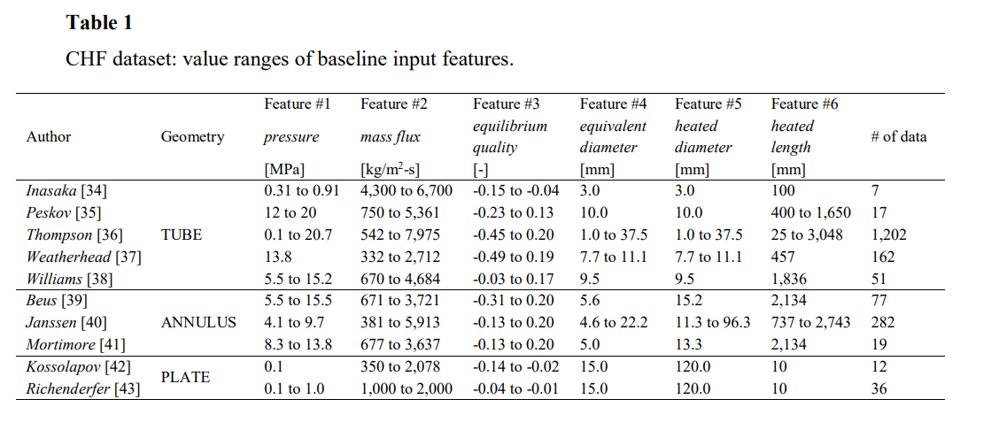

# Competición de Kaggle de ML: Feature Imputation with a Heat Flux Dataset

## Descripción de la competición
¡Bienvenido a la edición 2023 de la serie Kaggle Playground! Esta competición, "Imputación de características con un conjunto de datos de flujo de calor", es parte de la serie Tabular Tuesday y tiene como objetivo proporcionar un desafío ligero para la comunidad de Kaggle con el fin de aprender y mejorar sus habilidades en aprendizaje automático y ciencia de datos. El conjunto de datos de la competición se genera sintéticamente a partir de un modelo de aprendizaje profundo entrenado en el conjunto de datos "Predicting Critical Heat Flux", garantizando un equilibrio entre características del mundo real y etiquetas de prueba no disponibles.

## Conjunto de datos
El conjunto de datos para esta competición consta de los siguientes archivos:

- `data.csv`: El conjunto de datos de la competición, que incluye tanto los datos de entrenamiento como los de prueba. Tu objetivo es imputar los valores faltantes de la característica `x_e_out` (calidad de equilibrio).
- `sample_submission.csv`: Un archivo de muestra para enviar las predicciones en el formato correcto.
- Además se proporcionaba la base de datos original a partir de la cual se han generado los datos encontrados en `data.csv`

## Estructura de archivos

El proyecto sigue la siguiente estructura de carpetas:

- `data`: Carpeta que contiene los datos descargados, incluido el conjunto de datos original.
- `models`: Carpeta que almacena los modelos creados durante el desarrollo.
- `submissions`: Carpeta que contiene los archivos CSV de las presentaciones realizadas.
- `data_exploration.ipynb`: Cuaderno de Jupyter que contiene la exploración de datos y el proceso de imputación.
- `readme.md`: Archivo de texto que proporciona información detallada sobre el proyecto.

## Modelos Utilizados

Durante el desarrollo del proyecto, se probaron varios modelos de regresión para imputar los valores faltantes en la característica `x_e_out`. Estos modelos se implementaron utilizando la biblioteca Scikit-learn. A continuación, se presentan los modelos utilizados:

- `LinearRegression`: Modelo de regresión lineal que encuentra una relación lineal entre las características y las etiquetas.
- `DecisionTreeRegressor`: Modelo de regresión basado en árboles de decisión que divide los datos en función de diferentes características.
- `RandomForestRegressor`: Modelo de regresión basado en un conjunto de árboles de decisión, donde cada árbol vota por la predicción final.
- `SVR` (Support Vector Regressor): Modelo de regresión basado en máquinas de vectores de soporte que encuentra un hiperplano óptimo para separar los puntos de datos.
- `XGBoostRegressor`: (Extreme Gradient Boosting) es una biblioteca de aprendizaje automático de código abierto y ampliamente utilizada que se basa en el algoritmo de refuerzo de gradiente. XGBoostRegressor es la implementación de XGBoost específicamente diseñada para problemas de regresión.

Además de los modelos individuales, se exploraron técnicas de ensamblaje para mejorar el rendimiento predictivo. Estas técnicas incluyen:

- `StackingRegressor`: Modelo de ensamblaje que combina varios modelos de regresión y utiliza otro modelo (meta-modelo) para realizar la predicción final.
- `VotingRegressor`: Modelo de ensamblaje que combina las predicciones de varios modelos de regresión mediante votación.
- `Media`: Cálculo de la media de las predicciones realizadas por varios modelos.

Para encontrar los mejores hiperparámetros de cada modelo, se utilizó la técnica de GridSearch, que permite probar diferentes combinaciones de hiperparámetros y seleccionar los que produzcan el mejor rendimiento.

¡El desarrollo del proyecto combinó la exploración de datos, la selección y ajuste de modelos, y la evaluación del rendimiento para lograr una imputación precisa de los valores faltantes en la característica `x_e_out`!

## Feature Engineering
En la documentación del dataset original se encontraba la siguiente tabla en la que se especifica el valor que puede tomar cada variable.
Haciendo un EDA del dataset original se llega a la conclusión de que hay una relación entre ciertas variables y se procede a imputarlas directamente en el dataset nuevo para predecir con estos nuevos datos.

